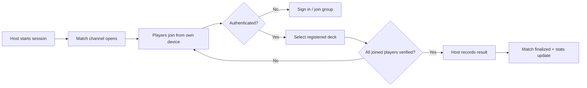
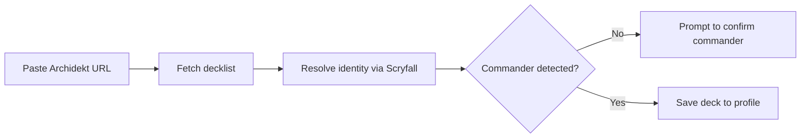

# Product Requirements Document: MTG Pod Manager MVP

## Executive Summary

**Product:** MTG Pod Manager
**Version:** MVP (1.0)
**Document Status:** Draft — Ready for Technical Design
**Last Updated:** June 9, 2026

### Product Vision
A persistent, per-group "league" for fixed Magic: The Gathering Commander playgroups. Every recurring pod gets a shared home for registered decks, **participation-verified** match logging, and the running stats (win rates, most-played decks) that current deck-centric or session-ephemeral tools don't keep across games.

### Success Criteria
- **North Star:** your own pod logs **≥1 match per week** through the app.
- A group reaches a usable, verified-logging loop within its first session.
- Architecture stays on Supabase + Vercel free tiers while supporting a clean path to a paid multi-group SaaS.

---

## Problem Statement

### Problem Definition
Recurring Commander pods have no good way to keep **persistent, group-scoped, trustworthy** stats. The data they care about is *per-group and longitudinal* ("who's winning our pod this year, on which decks"), but existing tools are built around decks, single sessions, or unverified self-reporting.

### Impact Analysis
- **User Impact:** Pods resort to spreadsheets, group chats, or memory — high friction, easily abandoned, and self-reported results no one fully trusts.
- **Market Impact:** EDH is the dominant MTG format with large, stable recurring playgroups; a fixed-pod league tracker is a clear, underserved niche.
- **Business Impact:** A verified, sticky per-group dataset is the foundation for a low-cost, per-group subscription SaaS later.

> ⚠️ **Uncertainty flag:** Competitor capabilities and third-party API ToS (Archidekt, Scryfall, MTG Companion) change frequently. The competitive gaps below reflect the research snapshot and should be re-verified during technical design.

---

## Target Audience

### Primary Persona: "The Pod Organizer"
**Demographics:**
- Adult hobbyist MTG player, plays EDH regularly with the same 2–4 person group.
- Comfortable with web apps and phones; not necessarily technical.

**Psychographics:**
- Mildly competitive, enjoys tracking and bragging rights.
- Values low friction at the table — does not want logging to interrupt the game.
- Mildly distrustful of "honor-system" stats.

**Jobs to Be Done:**
1. *Functional:* "Keep an accurate, lasting record of who won which game on which deck in our pod."
2. *Emotional:* "Settle who's actually the best in our group."
3. *Social:* "Give our group a shared scoreboard worth showing off."

**Current Solutions & Pain Points:**
| Current Solution | Pain Points | Our Advantage |
|---|---|---|
| Spreadsheet / group chat | Manual, abandoned quickly, no deck linkage, unverified | Verified per-player logging tied to registered decks |
| MTG Companion (game history) | Session/life-total focused, not persistent per-group league stats | Persistent, group-scoped league record |
| Archidekt playgroups / Deckbox | Deck/collection-centric, weak recurring-group match stats | Match + result tracking built around a fixed pod |

### Secondary Persona (acknowledged, not separately built for MVP)
- **Group members** who only join matches and register decks. For the MVP they share the same role surface as the organizer; **per-group admin** is held by the group creator under the hood.

---

## User Stories

### Epic: Verified Per-Group Match Logging

**Primary User Story:**
"As a pod organizer, I want every player to confirm participation and their deck from their own phone before a match is recorded, so that our group's stats are trustworthy and complete."

**Acceptance Criteria:**
- [ ] A match is only marked *logged* once every joined participant has authenticated and selected a registered deck.
- [ ] The host can see, in real time, which players have joined and which are still pending.
- [ ] A match cannot be finalized with unverified or duplicate participants.

### Supporting User Stories
1. "As a player, I want to create a group and invite my pod, so that all our data lives in one place." — *AC: creator becomes the group admin; only invited/joined members can read or write group data.*
2. "As a player, I want to register my decks by pasting an Archidekt link, so that match logging is just deck selection." — *AC: import resolves commander + card identity via Scryfall and saves the deck to my profile.*
3. "As a host, I want to start a live session and run the shared life-counter screen, so that one device tracks the table while others just join." — *AC: host opens a match channel; joiners attach from their own devices.*
4. "As a player, I want to view our group's win rate by player and most-played decks, so that we can see standings over time." — *AC: stats are group-scoped and update after each logged match.*

---

## Functional Requirements

### Core Features (MVP — P0)

#### Feature 1: Groups & Membership
- **Description:** Create a group, invite/join members, all data scoped to the group. Group creator = admin (single role surface for MVP).
- **User Value:** A persistent shared home for the pod's history.
- **Business Value:** The group is the unit of data, retention, and future billing.
- **Acceptance Criteria:**
  - [ ] A user can create a group and is recorded as its admin.
  - [ ] Members can join via invite; non-members cannot read or write group data (enforced by RLS).
  - [ ] All decks, matches, and results reference a group.
- **Dependencies:** Supabase Auth, Postgres RLS.
- **Estimated Effort:** M

#### Feature 2: Player Profiles & Deck Registration
- **Description:** Each player has a profile and a set of registered decks linked to them, including commander identity and imported card data.
- **User Value:** Logging a game becomes "pick my deck," not data entry.
- **Business Value:** Deck-linked results unlock the per-deck stats that make the product sticky.
- **Acceptance Criteria:**
  - [ ] A player can add, view, and remove decks on their profile.
  - [ ] Each deck stores commander/identity data and a card list.
- **Dependencies:** Archidekt import (F3), Scryfall data.
- **Estimated Effort:** M

#### Feature 3: Decklist Import (Archidekt only, v1)
- **Description:** Import a deck from an Archidekt URL; resolve card/commander identity through Scryfall as the canonical data source.
- **User Value:** Fast, accurate deck setup.
- **Business Value:** Lowers onboarding friction; clean card identity powers stats.
- **Acceptance Criteria:**
  - [ ] Pasting an Archidekt deck URL imports the list and detects the commander(s).
  - [ ] Card/commander identity is normalized via Scryfall.
  - [ ] Import failures surface a clear, recoverable error.
- **Dependencies:** Archidekt access, Scryfall API/bulk data, rate-limit etiquette.
- **Estimated Effort:** M–L
- ⚠️ **Risk flag:** Archidekt import reliability and ToS are the highest-uncertainty item; confirm in technical design and design for graceful failure.

#### Feature 4: Host Live Session (shared life-counter screen)
- **Description:** One device hosts a live match: runs the single shared life-counter for the table and opens the match for others to join.
- **User Value:** One screen tracks the table; no multi-device life sync needed.
- **Business Value:** Defines the "match" event that anchors all stats.
- **Acceptance Criteria:**
  - [ ] Host can start a session for 2–4 players and adjust life on the shared screen.
  - [ ] Host sees join status update in real time.
- **Dependencies:** Supabase Realtime (Presence/Broadcast), channel authorization.
- **Estimated Effort:** L
- **Note:** *Synced* life totals across devices are explicitly out of scope — only the host screen tracks life.

#### Feature 5: Join-to-Verify & Match Finalization
- **Description:** Other participants join the active match from their own devices, authenticate, and select a registered deck. The match logs only once participation is verified.
- **User Value:** Trustworthy, complete records with minimal table friction.
- **Business Value:** Verification is the core differentiator.
- **Acceptance Criteria:**
  - [ ] Each non-host participant authenticates and selects one registered deck.
  - [ ] Host records the result (winner / standings) for the verified participants.
  - [ ] Match is only finalized when all joined players are verified.
- **Dependencies:** F4, Auth, RLS, Realtime.
- **Estimated Effort:** L

#### Feature 6: Core Group Stats
- **Description:** Group-scoped **win rate by player** and **most-played deck**, plus a basic match history.
- **User Value:** The payoff — standings and trends over time.
- **Business Value:** The recurring reason to come back (drives the North Star).
- **Acceptance Criteria:**
  - [ ] Win rate by player computes correctly across logged matches in the group.
  - [ ] Most-played deck reflects logged participation.
  - [ ] Stats update after each finalized match.
- **Dependencies:** F1–F5; indexed queries.
- **Estimated Effort:** M

### Should Have (P1) — post-MVP
- Per-deck win rates and head-to-head matchups.
- Group leaderboard / standings view.
- Match history with notes/tags.

### Could Have (P2)
- Commander color-identity and archetype breakdowns.
- Streaks, seasons, and date-range filtering.

### Out of Scope (Won't Have — this release)
- Native iOS/Android apps — *responsive web only.*
- Real-time synced life totals across devices — *single host screen only.*
- Tournament/Swiss pairing logic.
- Non-Commander formats.
- Deckbuilding / recommendation features.
- Moxfield/Deckbox import — *Archidekt only for v1.*

---

## Non-Functional Requirements

### Performance
- **Page Load:** < 3 seconds on a mid-range phone over typical Wi-Fi.
- **Join latency:** Player join status visible to host within ~1–2 seconds.
- **Concurrent:** Comfortably handle a single 4-player match; design within free-tier Realtime connection limits.

### Security & Privacy
- **Authentication:** Supabase Auth.
- **Authorization:** Postgres **Row Level Security** scoping every read/write to group membership; channel authorization for Realtime match joins.
- **Data Protection:** No sensitive PII beyond auth identity; store only what stats require.
- **Compliance:** Lightweight at this scale; revisit (privacy policy, data export/delete) before paid SaaS launch.

### Usability
- **Accessibility:** WCAG 2.1 AA as a target (contrast, labels, focus order).
- **Responsive:** Mobile-first — phones used around the table.
- **Browser Support:** Latest 2 versions of Chrome, Safari, Firefox, Edge; iOS 15+, Android 11+.

### Scalability
- **Growth:** Single-group MVP must extend to many independent groups without schema change (group-scoped from day one).
- **Cost posture:** Run on Supabase + Vercel free tiers initially; architecture should not need rework to move to paid tiers.

---

## Quality Standards (Anti-Vibe Rules)

### Code Quality
- **Type Safety:** Strict TypeScript, no `any`.
- **Architecture:** Thin route handlers/components — logic in services; RLS as the source of truth for access, not client checks.
- **Error Handling:** Explicit error types; import and Realtime failures handled gracefully, never swallowed.
- **Testing:** Cover the critical path — group access (RLS), import, and match finalization.

### Design Quality
- **Design tokens only** — no raw hex/pixel values scattered in components.
- **Accessibility:** WCAG 2.1 AA verified on the core flows.
- **Performance:** Core Web Vitals in the green zone on mobile.

### What This Project Will NOT Accept
- Placeholder content in production (no "Lorem ipsum", sample decks).
- Features outside MVP scope (see Won't Have).
- Client-side-only access checks substituting for RLS.
- Half-working features — complete or cut.

---

## UI/UX Requirements

### Design Principles
1. **Table-first:** the live match flow must work fast on a phone, mid-game, without fuss.
2. **Verify, don't nag:** join/verify should feel like a quick tap, not a form.
3. **Stats as payoff:** standings should be glanceable and satisfying.

### Information Architecture
```
├── Auth (Sign Up / Sign In)
├── Groups
│   ├── Create / Join Group
│   └── Group Home (stats + recent matches)
├── Profile
│   └── My Decks (register / import from Archidekt)
├── Live Match
│   ├── Host: shared life-counter + join status
│   └── Join: authenticate → select deck → confirm
└── Stats
    ├── Win rate by player
    └── Most-played decks
```

### Key User Flows

#### Flow 1: Host + Join → Verified Log


#### Flow 2: Register a Deck


---

## Success Metrics

### North Star Metric
**Logged matches per active group per week** (target for MVP: ≥1 for your own pod, sustained through week 4).

### OKRs for MVP (First 90 Days)

**Objective 1 — Prove the verified-logging loop works for a real pod.**
- KR1: Your pod logs ≥1 verified match/week for 4 consecutive weeks.
- KR2: ≥90% of started matches reach *finalized* status (low drop-off mid-flow).
- KR3: ≥3 players per match successfully join-and-verify on their own devices.

**Objective 2 — Make onboarding frictionless.**
- KR1: A new player registers ≥1 deck via Archidekt import within their first session.
- KR2: Median deck-import time < 60 seconds.

### Metrics Framework
| Category | Metric | Target | Measurement |
|---|---|---|---|
| Activation | Group reaches 3+ players & 1 logged match | First session | DB query / event log |
| Engagement | Logged matches / active group / week | ≥1 (North Star) | DB query |
| Retention | Pod still logging in week 4 | Yes | DB query |
| Revenue | n/a this phase | — | Instrument now, convert later |

---

## Constraints & Assumptions

### Constraints
- **Budget:** Supabase + Vercel **free tiers** initially.
- **Timeline:** ~1 month to a usable MVP.
- **Resources:** Solo developer (Python/Django, React/Next.js, Postgres/Supabase experience).
- **Technical:** Next.js (App Router) + Supabase (Auth, Postgres, Realtime); responsive web only.

### Assumptions
- The primary user is a player-organizer using it for their own pod first.
- Archidekt import is must-have for v1 (no manual deck entry fallback assumed unless added).
- Scryfall is the canonical card/commander-identity source.
- Pods are 2–4 players, recurring and fixed.

### Open Questions
- Does Archidekt expose a stable, ToS-compliant import path, or is HTML/endpoint scraping required? (Resolve in technical design.)
- Minimum result model for MVP — winner-only vs full finishing order?
- Is a manual deck-entry fallback needed if an import fails at the table?

### Dependencies
- External: Archidekt (import), Scryfall (card data), Supabase, Vercel.
- Internal: RLS policies and Realtime channel auth must land before match finalization is trustworthy.

---

## Risk Assessment

| Risk | Probability | Impact | Mitigation |
|---|---|---|---|
| Archidekt import unreliable or ToS-restricted | Med | High | Treat as best-effort with graceful failure; consider manual-entry fallback; re-verify ToS in tech design |
| Supabase Realtime free-tier connection/message limits hit during matches | Med | Med | Keep one channel per match, lean payloads; monitor; define paid-tier upgrade trigger |
| Verification flow adds table friction → abandoned mid-match | Med | High | Minimize taps; show clear join status; allow host to nudge/resend |
| Scryfall rate limits / etiquette violations | Low | Med | Use bulk data + caching; respect documented rate limits |
| Scope creep (life sync, more importers, formats) | Med | Med | Won't-Have list enforced; revisit only post-MVP |

---

## MVP Definition of Done

### Feature Complete
- [ ] All P0 features (F1–F6) implemented.
- [ ] All acceptance criteria met.

### Quality Assurance
- [ ] Critical-path tests passing (RLS access, import, match finalization).
- [ ] Manual end-to-end run of host + 3 joiners on separate devices.
- [ ] Mobile performance acceptable on a real phone.

### Documentation
- [ ] Setup/deploy notes.
- [ ] Brief user walkthrough for a new group.

### Release Ready
- [ ] Staging validated on Vercel.
- [ ] Basic monitoring on Supabase usage (Realtime connections, DB size).
- [ ] One complete verified-logging journey works end-to-end.

---

## Appendices

### A. Competitive Analysis (summary)
| Tool | What it does | Where it falls short for a fixed pod |
|---|---|---|
| MTG Companion | Life tracking, basic game history | Session/life-focused; not persistent per-group league stats |
| Archidekt playgroups | Deck management, some group features | Deck/collection-centric; weak recurring-group match stats; no verified logging |
| Deckbox | Collection/deck tracking | Not built for recurring match results/standings |
| Spreadsheets / chat | Whatever the pod builds | Manual, unverified, abandoned quickly |

> ⚠️ Re-verify each before build — these tools update often.

### B. Technical Specifications
Detailed schema (groups/players/decks/matches/results DDL), RLS policies, Realtime channel design, and stat SQL (win-rate-by-player, most-played-deck) belong in the **Technical Design Document (Part 3)**. The research file already sketches these and is the input for that step.

### C. Mockups/Wireframes
To be produced at technical-design stage.

---
*PRD Version: 1.0*
*Status: Draft — Ready for Technical Design*
*Owner: Pod Organizer (solo developer)*
