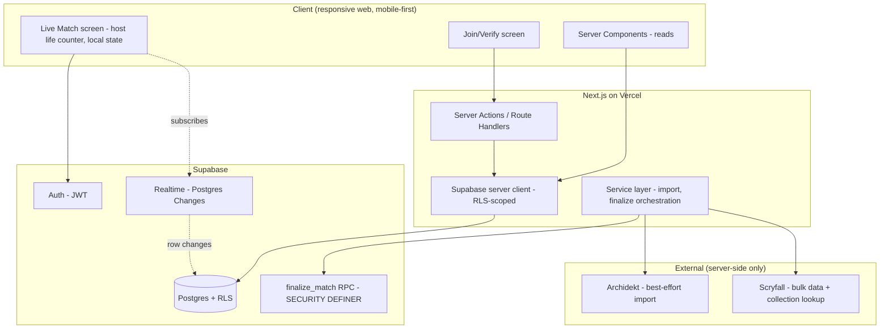

# Technical Design Document: MTG Pod Manager MVP

## Executive Summary

**System:** MTG Pod Manager
**Version:** MVP 1.0
**Architecture Pattern:** Full-stack Next.js (App Router) on a Supabase backend-as-a-service; Postgres Row Level Security (RLS) as the authorization source of truth.
**Audience:** Solo developer (Python/Django, React/Next.js, Postgres/Supabase).
**Estimated Effort:** ~3–4 person-weeks for P0 (F1–F6), assuming part-time solo pace.

The differentiator — *participation-verified* match logging — is treated as the architectural spine of this design. The single most important decision below is that match finalization is enforced by a `SECURITY DEFINER` Postgres function, not by client or app-layer checks, so "trustworthy stats" is a database invariant rather than a convention.

Confirmed inputs from the elicitation:
- **Result model:** winner-only (`matches.winner_user_id`).
- **Import fallback:** manual deck entry is in scope for v1.

---

## Architecture Overview

### High-Level Architecture



Life totals are deliberately **not** in this diagram's data flow: per the PRD, synced life across devices is out of scope. The host screen tracks life in local React state only. Realtime carries participation status, nothing else — this is what keeps payloads small enough to live inside the free tier.

### Tech Stack Decision

The PRD fixes the stack, so this section confirms rather than re-debates it, and records *why* each choice is the right one for these constraints.

#### Frontend
- **Framework:** Next.js (App Router) — fixed by PRD; correct for a solo dev who wants reads via Server Components (no client data-fetching boilerplate) and writes via Server Actions.
- **Language:** TypeScript, `strict`, no `any` (PRD anti-vibe rule).
- **Styling:** Tailwind CSS with a **design-token layer** (CSS variables in `globals.css`, surfaced as Tailwind theme extensions). The PRD bans raw hex/pixel values in components, so tokens are not optional.
- **UI components:** shadcn/ui — copy-in components you own and can theme via tokens. Avoids a heavy dependency and matches the token requirement.
- **State:** React state + URL state. No global store needed at MVP scale; the live-match screen is the only stateful surface and it is local-only.

#### Backend
- **Runtime:** Supabase (managed Postgres + Auth + Realtime). No separate Node/Python service.
- **Data access:** Supabase JS client via `@supabase/ssr` for cookie-based server auth.
- **Invariant enforcement:** Postgres functions (RPC) for anything that spans rows (finalization, invite acceptance).
- **Validation:** Zod at every Server Action / Route Handler boundary; Postgres `CHECK` constraints as the backstop.

#### Infrastructure
- **Hosting:** Vercel (Hobby/free) — Git push to deploy, preview deploys per PR.
- **Database / Auth / Realtime:** Supabase (Free).
- **Monitoring:** Supabase dashboard (Realtime connections, DB size) + Vercel logs for MVP. Sentry deferred to first paid milestone.

---

## Key Architecture Decisions

For each decision: alternatives, the recommendation, and the honest trade-off.

### Decision 1 — Backend shape: Supabase BaaS vs. separate API service

| Option | Pros | Cons |
|---|---|---|
| **Supabase BaaS (recommended)** | One vendor; Auth + DB + Realtime integrated; RLS gives you authorization for free; fits 1-month solo timeline | Business logic must be disciplined or it leaks client-side; vendor lock-in to Postgres+Supabase conventions |
| Separate Node/Fastify API + Supabase Postgres | Full control of the request layer; logic clearly server-only | Doubles the surface area to build, deploy, secure; throws away RLS as the primary boundary; unrealistic in a month solo |
| Next.js Route Handlers as the *only* API, RLS off | Familiar | Re-implements access control by hand in every route — exactly the "client-side checks substituting for RLS" the PRD forbids |

**Recommendation:** Supabase BaaS with RLS as the authorization boundary. **Trade-off accepted:** you must keep secrets and import/finalize logic strictly in Server Actions/Route Handlers and never trust the browser; RLS is the net under that discipline, not a substitute for it.

### Decision 2 — Where match-finalization invariants live (the core decision)

The acceptance criteria — *a match finalizes only when every joined participant is authenticated, has selected a deck, there are no duplicates, and the winner is a participant* — are **cross-row invariants**. RLS governs single-row access; it cannot by itself guarantee "all sibling rows are verified."

| Option | Pros | Cons |
|---|---|---|
| **`SECURITY DEFINER` Postgres function `finalize_match()` (recommended)** | Atomic (single transaction, `FOR UPDATE` lock); server-enforced; the *only* code path that can set `status='finalized'`; trivially testable with pgTAP | PL/pgSQL to write and maintain |
| App-layer check in a Server Action, then `UPDATE` | All logic in TypeScript | Check-then-write race conditions; a bug or a crafted request can finalize a half-verified match — defeats the entire product premise |
| Database trigger validating on `UPDATE` | Enforced in DB | Awkward to express "winner came from this set"; harder to return clear errors to the client |

**Recommendation:** `finalize_match(match_id, winner_id)` as `SECURITY DEFINER`, plus an RLS policy on `matches` that **forbids ordinary updates from flipping status to `finalized`**. The function (owned by the table owner) bypasses that policy; nothing else can. **Trade-off accepted:** the most important business rule lives in SQL, not TypeScript — a deliberate choice because "trustworthy" is the whole product.

### Decision 3 — Live-session join status transport

| Option | Pros | Cons |
|---|---|---|
| **Realtime Postgres Changes on `match_participants`, filtered by `match_id` (recommended)** | The DB *is* the source of truth — no separate presence protocol to keep in sync; RLS on the table automatically scopes who receives events; ~1–2s latency meets the NFR | Each match = one realtime subscription; counts against free-tier concurrent connections |
| Realtime Broadcast/Presence | Lowest latency; ephemeral | You now maintain a second representation of "who's joined" alongside the DB rows; risk of UI and DB disagreeing |
| Polling `match_participants` every 2–3s | Zero Realtime usage; dead simple; a guaranteed fallback | Slightly laggy; more DB reads |

**Recommendation:** Postgres Changes as primary, with a **polling fallback path already written** so that if free-tier Realtime limits bite mid-match you can flip a flag and degrade gracefully (this directly mitigates the PRD's Realtime risk). **Trade-off accepted:** marginally higher latency than Broadcast, in exchange for never having two sources of truth for participation — which is the thing that must be trustworthy.

> **Verify before relying on it:** Supabase Realtime's behavior for authorizing Postgres Changes against RLS (and the separate "Realtime Authorization" model for Broadcast/Presence private channels) has changed across releases. Confirm current behavior in the Supabase Realtime docs during setup. Design assumes a member-only `SELECT` policy on `match_participants` is sufficient to scope change events.

### Decision 4 — Archidekt import resilience (highest-risk item)

The PRD flags Archidekt import as the top risk: no clearly documented, stable, ToS-blessed public API. The design therefore **does not bet the product on it**.

Strategy:
1. **Decouple deck identity from deck contents.** For MVP stats you only need a deck's *identity* — name + commander (+ color identity). The full 100-card list is a future feature (per-deck archetype stats are P2). So a deck row requires only name + commander; `card_data` is nullable.
2. **Import runs server-side only** (never from the browser): avoids CORS, hides parsing, lets you cache, and keeps any scraping/etiquette concerns off the client.
3. **Scryfall is canonical** for card/commander identity. Use **bulk data** (downloaded and cached) plus the batch `collection` endpoint for lookups — respect Scryfall etiquette (a descriptive `User-Agent`, ~50–100ms between calls, never hammer per-card). Cache resolved commanders so repeat imports are free.
4. **Graceful failure → manual fallback** (confirmed in scope): if Archidekt fetch/parse fails, surface a clear, recoverable error and drop the user into a two-field manual form: deck name + commander (autocompleted via Scryfall search). That produces a fully valid deck for logging without typing a card list.

**Trade-off accepted:** v1 deck "completeness" varies (some decks have full lists, some only identity). That is fine because no MVP stat depends on the card list — only on deck identity and participation.

> **Verify before build:** re-check Archidekt's current ToS and whether any documented/stable endpoint exists. If the only path is scraping their internal JSON, treat it as best-effort, low-frequency, server-side, and cached — and lean on the manual fallback as the real guarantee.

### Decision 5 — Snapshot deck identity onto participants

When a player verifies, copy `deck_name` and `commander` into the `match_participants` row as snapshots (alongside the `deck_id` reference).

- **Why:** (a) historical stats stay correct even if a player later renames or deletes a deck; (b) group members can read match history and "most-played deck" by reading only `match_participants`, so other players' `decks` rows can stay strictly owner-private — simpler, tighter RLS.

**Trade-off accepted:** mild denormalization. Worth it for stable history and a cleaner authorization model.

---

## Component Design

### Frontend structure (Next.js App Router)

```
src/
├── app/
│   ├── (auth)/sign-in, sign-up
│   ├── groups/
│   │   ├── page.tsx                 # list / create / join
│   │   └── [groupId]/page.tsx       # group home: stats + recent matches (Server Component)
│   ├── profile/decks/page.tsx       # register / import / manual entry
│   ├── match/
│   │   ├── [matchId]/host/page.tsx  # host: local life counter + live join status
│   │   └── [matchId]/join/page.tsx  # join: auth -> select deck -> confirm
│   └── stats/[groupId]/page.tsx
├── components/ui/                   # shadcn, token-themed
├── components/features/             # match, decks, stats
├── lib/
│   ├── supabase/server.ts           # @supabase/ssr server client
│   ├── supabase/client.ts           # browser client (Realtime subscribe only)
│   ├── services/                    # import.ts, scryfall.ts, matches.ts
│   └── validators/                  # zod schemas
└── styles/globals.css               # design tokens (CSS vars)
```

Reads are Server Components hitting an RLS-scoped Supabase client. Writes are Server Actions that validate with Zod, then either write directly (RLS-protected) or call an RPC. The browser client is used almost exclusively to subscribe to the match channel.

---

## Database Schema

Winner-only result model. UUID PKs, `timestamptz` everywhere.

```sql
-- 1:1 with auth.users
create table public.profiles (
  id uuid primary key references auth.users(id) on delete cascade,
  display_name text not null check (char_length(display_name) between 1 and 40),
  created_at timestamptz not null default now()
);

create table public.groups (
  id uuid primary key default gen_random_uuid(),
  name text not null check (char_length(name) between 1 and 60),
  created_by uuid not null references public.profiles(id),
  created_at timestamptz not null default now()
);

create type group_role as enum ('admin','member');

create table public.group_members (
  group_id uuid not null references public.groups(id) on delete cascade,
  user_id  uuid not null references public.profiles(id) on delete cascade,
  role     group_role not null default 'member',
  joined_at timestamptz not null default now(),
  primary key (group_id, user_id)
);

create table public.group_invites (
  id uuid primary key default gen_random_uuid(),
  group_id uuid not null references public.groups(id) on delete cascade,
  code text not null unique,
  created_by uuid not null references public.profiles(id),
  expires_at timestamptz not null default (now() + interval '14 days'),
  created_at timestamptz not null default now()
);

create type deck_source as enum ('archidekt','manual');

create table public.decks (
  id uuid primary key default gen_random_uuid(),
  user_id uuid not null references public.profiles(id) on delete cascade,
  name text not null check (char_length(name) between 1 and 80),
  commander_name text not null,
  commander_scryfall_id uuid,                  -- nullable until resolved
  color_identity text[] not null default '{}', -- e.g. {W,U,B}
  source deck_source not null,
  source_url text,
  card_data jsonb,                             -- nullable; full list is best-effort only
  created_at timestamptz not null default now(),
  updated_at timestamptz not null default now()
);

create type match_status as enum ('open','finalized','cancelled');

create table public.matches (
  id uuid primary key default gen_random_uuid(),
  group_id uuid not null references public.groups(id) on delete cascade,
  host_id uuid not null references public.profiles(id),
  status match_status not null default 'open',
  winner_user_id uuid references public.profiles(id),   -- set only at finalize
  started_at timestamptz not null default now(),
  finalized_at timestamptz
);

create table public.match_participants (
  id uuid primary key default gen_random_uuid(),
  match_id uuid not null references public.matches(id) on delete cascade,
  user_id  uuid not null references public.profiles(id) on delete cascade,
  deck_id  uuid references public.decks(id),     -- chosen at verify time
  deck_name_snapshot text,                       -- snapshot: stable history + simpler RLS
  commander_snapshot text,
  verified boolean not null default false,
  joined_at timestamptz not null default now(),
  unique (match_id, user_id)                     -- no duplicate participants
);

-- Indexes
create index on public.group_members (user_id);
create index on public.matches (group_id, status);
create index on public.matches (group_id, finalized_at);
create index on public.match_participants (match_id);
create index on public.match_participants (deck_id);
create index on public.decks (user_id);
```

---

## Authorization: RLS Policies

A `SECURITY DEFINER` helper avoids the classic self-referential recursion when a `group_members` policy needs to query `group_members`:

```sql
create or replace function public.is_group_member(g uuid)
returns boolean language sql security definer stable
set search_path = public as $$
  select exists (
    select 1 from public.group_members
    where group_id = g and user_id = auth.uid()
  );
$$;
```

```sql
-- Enable RLS on every table
alter table public.profiles           enable row level security;
alter table public.groups             enable row level security;
alter table public.group_members      enable row level security;
alter table public.group_invites      enable row level security;
alter table public.decks              enable row level security;
alter table public.matches            enable row level security;
alter table public.match_participants enable row level security;

-- profiles: self + co-members are readable; write only self
create policy profiles_select on public.profiles for select using (
  id = auth.uid()
  or exists (
    select 1 from public.group_members gm1
    join public.group_members gm2 on gm1.group_id = gm2.group_id
    where gm1.user_id = auth.uid() and gm2.user_id = profiles.id
  )
);
create policy profiles_insert_self on public.profiles for insert with check (id = auth.uid());
create policy profiles_update_self on public.profiles for update using (id = auth.uid());

-- groups
create policy groups_select_member on public.groups for select using (public.is_group_member(id));
create policy groups_insert on public.groups for insert with check (created_by = auth.uid());
create policy groups_update_admin on public.groups for update using (
  exists (select 1 from public.group_members
          where group_id = groups.id and user_id = auth.uid() and role = 'admin')
);

-- group_members: members can read their group's roster.
-- Inserts go through accept_invite()/create_group() RPCs (SECURITY DEFINER), not direct.
create policy gm_select on public.group_members for select using (public.is_group_member(group_id));

-- decks: strictly owner-only (group reads come from participant snapshots)
create policy decks_all_own on public.decks for all
  using (user_id = auth.uid()) with check (user_id = auth.uid());

-- matches: members read; host creates; host may edit only while 'open',
-- and may NOT flip status to finalized via plain update (RPC only).
create policy matches_select on public.matches for select using (public.is_group_member(group_id));
create policy matches_insert_host on public.matches for insert
  with check (host_id = auth.uid() and public.is_group_member(group_id));
create policy matches_update_open on public.matches for update
  using (host_id = auth.uid() and status = 'open')
  with check (status = 'open');   -- blocks setting status = 'finalized'

-- match_participants: members read; a user manages only their own row, only while match is open
create policy mp_select on public.match_participants for select using (
  exists (select 1 from public.matches m
          where m.id = match_id and public.is_group_member(m.group_id))
);
create policy mp_insert_self on public.match_participants for insert with check (
  user_id = auth.uid()
  and exists (select 1 from public.matches m
              where m.id = match_id and m.status = 'open' and public.is_group_member(m.group_id))
);
create policy mp_update_self on public.match_participants for update using (
  user_id = auth.uid()
  and exists (select 1 from public.matches m where m.id = match_id and m.status = 'open')
);
```

---

## Match Finalization (the integrity core)

```sql
create or replace function public.finalize_match(p_match_id uuid, p_winner uuid)
returns void
language plpgsql
security definer
set search_path = public
as $$
declare
  v_host uuid;
  v_status match_status;
  v_total int;
  v_unverified int;
  v_winner_ok boolean;
begin
  -- lock the row to prevent concurrent finalize
  select host_id, status into v_host, v_status
  from public.matches where id = p_match_id for update;

  if v_host is null then raise exception 'match_not_found'; end if;
  if v_host <> auth.uid() then raise exception 'only_host_can_finalize'; end if;
  if v_status <> 'open' then raise exception 'match_not_open'; end if;

  select count(*),
         count(*) filter (where verified = false or deck_id is null)
    into v_total, v_unverified
  from public.match_participants where match_id = p_match_id;

  if v_total < 2 then raise exception 'need_at_least_two_participants'; end if;
  if v_unverified > 0 then raise exception 'unverified_participants_present'; end if;

  select exists (
    select 1 from public.match_participants
    where match_id = p_match_id and user_id = p_winner
  ) into v_winner_ok;
  if not v_winner_ok then raise exception 'winner_must_be_participant'; end if;

  update public.matches
     set status = 'finalized', winner_user_id = p_winner, finalized_at = now()
   where id = p_match_id;
end;
$$;

revoke all on function public.finalize_match(uuid, uuid) from public;
grant execute on function public.finalize_match(uuid, uuid) to authenticated;
```

Duplicate participants are impossible by the `unique (match_id, user_id)` constraint; the function re-checks verification, count, and winner membership atomically under a row lock. Because plain updates can't set `status='finalized'` (RLS `with check`), this function is the only door.

`create_group()` and `accept_invite(code)` follow the same `SECURITY DEFINER` pattern: validate, then insert the `group_members` row (creator → `admin`, invitee → `member`). This keeps `group_members` inserts off the public surface entirely.

---

## Stats (group-scoped, RLS-respecting)

Views declared `security_invoker = on` (Postgres 15+, which Supabase runs) so the querying user's RLS on the base tables applies automatically — the views are group-scoped without any extra `where`:

```sql
create view public.group_player_winrates with (security_invoker = on) as
select
  m.group_id,
  mp.user_id,
  count(*) filter (where m.status = 'finalized') as games,
  count(*) filter (where m.status = 'finalized' and m.winner_user_id = mp.user_id) as wins,
  round(
    (count(*) filter (where m.status='finalized' and m.winner_user_id = mp.user_id))::numeric
    / nullif(count(*) filter (where m.status='finalized'), 0), 3
  ) as win_rate
from public.match_participants mp
join public.matches m on m.id = mp.match_id
group by m.group_id, mp.user_id;

create view public.group_deck_play_counts with (security_invoker = on) as
select
  m.group_id,
  mp.deck_id,
  mp.deck_name_snapshot,
  mp.commander_snapshot,
  count(*) as times_played
from public.match_participants mp
join public.matches m on m.id = mp.match_id
where m.status = 'finalized'
group by m.group_id, mp.deck_id, mp.deck_name_snapshot, mp.commander_snapshot
order by times_played desc;
```

These cover F6 directly: win rate by player, and most-played deck. They recompute on read — fine at pod scale; materialize later only if a group ever has thousands of matches.

---

## Feature → Implementation Map

| PRD Feature | How it's built | Enforced by |
|---|---|---|
| F1 Groups & Membership | `create_group()` / `accept_invite()` RPCs; `group_invites` codes | RLS + `is_group_member()` |
| F2 Profiles & Decks | Owner-private `decks` CRUD via Server Actions | `decks_all_own` RLS |
| F3 Archidekt import (+ manual fallback) | Server-side fetch → Scryfall resolve → save identity; on failure, two-field manual form | `lib/services/import.ts`, `scryfall.ts` |
| F4 Host Live Session | Host page; **local** life counter; subscribe to participants channel | Realtime Postgres Changes |
| F5 Join-to-Verify & Finalize | Join page writes own participant row; host calls `finalize_match()` | `mp_insert_self/update_self` + `finalize_match()` |
| F6 Core Stats | Two `security_invoker` views | RLS via views |

---

## Security

- **Auth:** Supabase Auth (email/OTP or password). JWT in HTTP-only cookies via `@supabase/ssr`.
- **Authorization:** RLS on every table; no client-side access checks (PRD rule). RPCs `SECURITY DEFINER` only where cross-row invariants demand it, each with `revoke ... from public; grant execute to authenticated`.
- **PII:** none beyond auth identity + a display name (PRD). Don't collect more.
- **Secrets:** Supabase service-role key is **server-only** (never shipped to the browser); imports and RPCs run server-side. The anon key + RLS is the only thing the browser touches.
- **Input validation:** Zod at every action boundary, mirrored by Postgres `CHECK` constraints.
- **Realtime channel scope:** members-only `SELECT` on `match_participants` gates who receives change events (verify against current Supabase Realtime authorization behavior).

---

## Testing Strategy

PRD requires the critical path covered: RLS access, import, match finalization.

| Layer | Tool | What it covers |
|---|---|---|
| **RLS policies** | **pgTAP** (Supabase local) | A non-member cannot read/write a group's matches, decks, participants; a member can. This is the highest-value test suite. |
| Finalization invariants | pgTAP | `finalize_match` rejects unverified, <2 players, non-participant winner, non-host caller; accepts a valid set exactly once |
| Import / Scryfall | Vitest | Parse fixture Archidekt payloads; mock Scryfall; assert graceful failure → manual-fallback path |
| Services & validators | Vitest | Zod schemas, deck snapshot logic |
| Happy-path E2E | Playwright | Host opens match → (simulated) joiners authenticate, pick deck, verify → host finalizes → stats update. Use separate auth contexts to simulate multiple devices. |

Multi-device realtime is genuinely hard to E2E; the pgTAP suite on `finalize_match` is what actually protects the product's trust guarantee, so weight effort there.

---

## Development Workflow

- **Git:** GitHub Flow (`main` + short-lived feature branches) — right for solo.
- **CI (GitHub Actions):** `typecheck` → `lint` → `vitest` → spin up Supabase local + run pgTAP → `next build`. Block merge on red.
- **Migrations:** Supabase CLI migrations checked into the repo; schema + RLS + RPCs are code, reviewed like code.
- **Preview deploys:** Vercel preview per PR; production on merge to `main`.
- **Pre-commit (optional):** format + lint via a hook manager (e.g. lint-staged) to keep CI green.

### AI Assistance Strategy

| Task | Suggested tool | Why |
|---|---|---|
| Schema, RLS, RPC, stats SQL | Claude / Claude Code | Strong at multi-file SQL + reasoning about RLS recursion and invariants |
| Component + Server Action scaffolding | Cursor or Claude Code | Fast iteration across files |
| Debugging Realtime / Supabase quirks | Any, with the official docs pasted in | These APIs shift; ground the model in current docs |

Claude Code is an agentic CLI with session memory, useful for the migration-heavy SQL work here. Verify current setup/requirements in the official Anthropic docs rather than assuming — product details change.

---

## Deployment & Environment

```bash
# .env.local  (server values never exposed to the client bundle)
NEXT_PUBLIC_SUPABASE_URL=...
NEXT_PUBLIC_SUPABASE_ANON_KEY=...
SUPABASE_SERVICE_ROLE_KEY=...        # server-only; used by import/admin paths
SCRYFALL_USER_AGENT="MTGPodManager/0.1 (contact@example.com)"
```

Deploy: push to GitHub → Vercel builds → set env vars in Vercel project settings (not in the repo). Supabase project hosts DB/Auth/Realtime; apply migrations via the Supabase CLI in CI or manually for the first cut.

---

## Cost Analysis

> **Verify all pricing on each vendor's page before relying on it. Tiers change. Last reviewed: 2026-06.**

| Service | MVP tier | Verify at |
|---|---|---|
| Vercel | Hobby (free) | vercel.com/pricing |
| Supabase | Free | supabase.com/pricing |
| Scryfall | Free (etiquette-bound, not a paid API) | scryfall.com/docs/api |
| Archidekt | n/a — best-effort, re-check ToS | archidekt.com |

**Free-tier watch points (mapped to PRD risks):**
- **Realtime concurrent connections / messages** — one subscription per active match keeps this minimal; the polling fallback is the escape hatch. Add a billing/usage check before inviting other pods.
- **DB size & paused-project policy on free Supabase** — fine for one pod; watch as groups multiply.
- **Upgrade trigger:** move Supabase to a paid tier when (a) Realtime connections approach the free cap during normal play, or (b) the project risks auto-pausing from inactivity once real users depend on it.

---

## Risk Mitigation (tied to PRD risks)

| PRD Risk | Design response |
|---|---|
| Archidekt unreliable / ToS-restricted (High) | Server-side best-effort; deck *identity* decoupled from card list; **manual fallback in scope**; cache via Scryfall. Re-verify ToS before build. |
| Realtime free-tier limits (Med) | One lean channel per match (status only, no life sync); polling fallback already designed; usage monitoring before scaling. |
| Verification adds table friction (High) | Join/verify is a single participant-row write from the player's phone; host sees status live; finalize is one host action. Minimize taps. |
| Scryfall rate limits (Med) | Bulk data + cache + batch `collection` lookups + correct `User-Agent`; never per-card hammering. |
| Scope creep (Med) | Won't-Have list honored: no life sync, no extra importers, no formats. P1/P2 explicitly out. |

---

## Resolved Open Questions (from PRD)

- **Archidekt import path:** treat as best-effort server-side; design for graceful failure; manual fallback is the guarantee. (Confirm ToS at build time.)
- **Result model:** **winner-only** — `matches.winner_user_id`, validated to be a participant. Full finishing order is a clean future migration (add a `placement` column to `match_participants`) with no schema rework now.
- **Manual deck-entry fallback:** **in scope** — two fields (name + Scryfall-resolved commander), no card list required.

---

## Scaling Path

- **Phase 1 — one pod (now):** views recompute on read; free tiers; no caching layer.
- **Phase 2 — many independent groups:** schema is already group-scoped from day one, so no rework. Add billing/usage alerts; consider Supabase paid tier; add Sentry.
- **Phase 3 — heavy groups:** materialize stats (or add a `match_stats` rollup updated in `finalize_match`); read replicas if needed; revisit Realtime strategy.

---

## Definition of Technical Success

- All P0 features (F1–F6) work end to end on real phones around a table.
- A non-member provably **cannot** read or write another group's data (pgTAP green).
- A match **cannot** reach `finalized` with an unverified or duplicate participant, or a non-participant winner (pgTAP green).
- Win rate by player and most-played deck compute correctly and update after each finalized match.
- Runs within Supabase + Vercel free tiers for a single pod, with a known upgrade trigger.
- Solo dev can apply a migration and deploy in minutes, and understands every RLS policy and RPC in the repo.

---
*Technical Design for: MTG Pod Manager*
*Approach: Full-stack Next.js (App Router) + Supabase BaaS, RLS as source of truth*
*Estimated Time to MVP: ~3–4 weeks (part-time solo)*
*Estimated Cost: $0/month at MVP scale (free tiers; verify vendor pricing)*
*Version: 1.0 — Last reviewed 2026-06-09 — Next review: +1 month*
